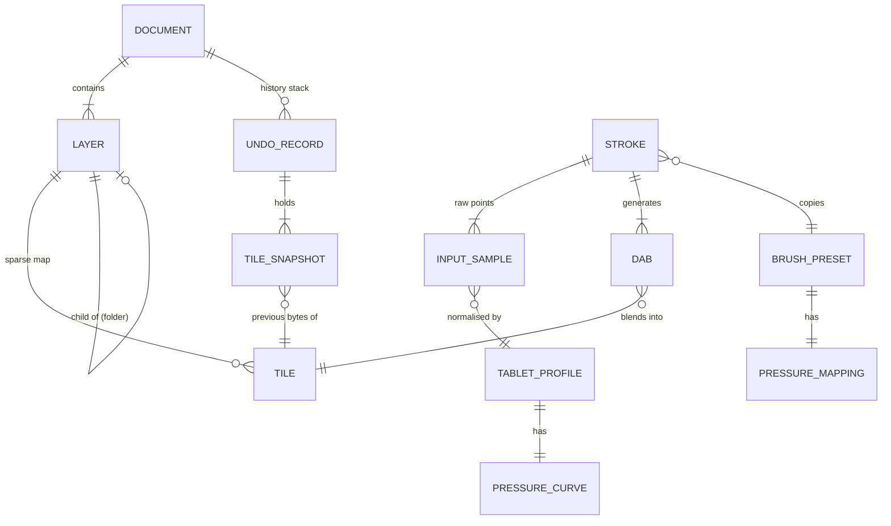
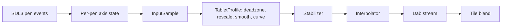

# Sable — Data Model

The types the `engine` target owns, and the on-disk format they serialise to.
Written as C++23 because the field names and the ownership are both part of the
contract. Exact syntax is not — these compile in spirit, not necessarily as
pasted.

Terms are defined where the field is defined. "density", "flow", "dilution", and
"persistence" are used loosely in the older design notes, so the definition
attached to each field below is the authoritative one.

Relevant decisions: D-001 (C++23), D-003 (engine links no SDL/ImGui), D-004
(8-bit premultiplied), D-005 (sparse tiles), D-006 (undo snapshots), D-011 (ZIP
project file), D-012 (`std::expected` in the engine).

---

## Entity relationships



---

## Colour

Premultiplied and straight alpha are **different types**. Two structs, and they
prevent the single most common bug class in this kind of engine — the dark or
grey halo around exported strokes, which is always someone compositing
straight-alpha values or exporting premultiplied ones.

```cpp
namespace sbl {

struct StraightRgba8;

/// Channels already multiplied by alpha. Everything inside the engine.
/// 50% red is {128, 0, 0, 128} — not {255, 0, 0, 128}.
struct PremulRgba8 {
    uint8_t r, g, b, a;
    [[nodiscard]] StraightRgba8 unpremultiply() const noexcept;
};

/// What the user picks, and what PNG files contain. Boundaries only.
struct StraightRgba8 {
    uint8_t r, g, b, a;
    [[nodiscard]] PremulRgba8 premultiply() const noexcept;
};

}
```

No implicit conversion between them, and no constructor taking the other. The
compiler must reject a mix-up, or the type split earns nothing.

Compositing is then `dst = src + dst * (1 - src.a)` per channel, with no
per-pixel divide. The 8-bit round-trip is lossy at low alpha, so a
save/load/save cycle must be tested for drift.

**Matching SDL:** canvas textures are drawn with
`SDL_BLENDMODE_BLEND_PREMULTIPLIED` (D-002). The default blend mode assumes
straight alpha and will render "nearly right" — dark fringes on soft edges — for
as long as it takes someone to notice.

---

## Canvas storage

### Tile

The unit of allocation, of redraw, of undo, and of texture upload. Everything
else follows from it.

```cpp
inline constexpr int TILE_SIZE   = 256;
inline constexpr int TILE_PIXELS = TILE_SIZE * TILE_SIZE;
inline constexpr int TILE_BYTES  = TILE_PIXELS * 4;   // 262'144

/// Premultiplied RGBA8, row-major, no padding.
/// Heap-allocated deliberately: 256 KiB must never land on the stack, and
/// moving a Tile must stay a pointer move rather than a memcpy.
class Tile {
public:
    Tile() : px_(std::make_unique<PremulRgba8[]>(TILE_PIXELS)) {}
    Tile(Tile&&) noexcept = default;              // move-only, by design
    Tile& operator=(Tile&&) noexcept = default;
    Tile(const Tile&) = delete;                   // copy must be explicit
    Tile& operator=(const Tile&) = delete;

    [[nodiscard]] Tile clone() const;             // for undo snapshots
    [[nodiscard]] PremulRgba8*       pixels() noexcept       { return px_.get(); }
    [[nodiscard]] const PremulRgba8* pixels() const noexcept { return px_.get(); }
    [[nodiscard]] PremulRgba8 pixel(int x, int y) const noexcept;
    void setPixel(int x, int y, PremulRgba8) noexcept;
    void fill(PremulRgba8) noexcept;

private:
    std::unique_ptr<PremulRgba8[]> px_;
};
```

The buffer is typed rather than `std::byte[]` so the pixel accessors need no
`reinterpret_cast`. The layout is identical, which is what lets the whole tile
go to `SDL_UpdateTexture` as one `SDL_PIXELFORMAT_RGBA32` upload.

Move-only with an explicit `clone()` is the point: an accidental copy of a tile
is 256 KB of silent memcpy, and in the undo path it happens once per touched
tile per stroke. Make the copy a thing you have to type.

A fully transparent tile is **not allocated** — an absent map entry means empty.

### Layer

```cpp
using TileKey = std::pair<int32_t, int32_t>;   // tile coords, not pixels

/// std::unordered_map has no hash for std::pair. Supply one; do not reach
/// for boost::hash_combine or a new dependency for four lines.
struct TileKeyHash {
    size_t operator()(const TileKey& k) const noexcept {
        return std::hash<uint64_t>{}(
            (static_cast<uint64_t>(static_cast<uint32_t>(k.first)) << 32) |
             static_cast<uint32_t>(k.second));
    }
};

// Separable modes only — the non-separable HSL ones (Hue, Saturation, Colour,
// Luminosity) are not per-channel and are not here. Append only: the order is
// what the layer panel's dropdown indexes into.
enum class BlendMode {
    Normal, Multiply, Screen, Add, Overlay,
    Darken, Lighten, ColourDodge, ColourBurn, HardLight, SoftLight,
    Difference, Exclusion,
};
enum class LayerKind { Raster, Folder };

using LayerId = uint32_t;                      // stable; never reused in a document
inline constexpr LayerId NO_LAYER = 0;

struct Layer {
    LayerId   id   = NO_LAYER;
    LayerKind kind = LayerKind::Raster;
    std::string name;

    /// Sparse. Raster layers only; a Folder keeps this empty.
    std::unordered_map<TileKey, Tile, TileKeyHash> tiles;

    float     opacity = 1.0f;          // 0..1, applied at composite time
    BlendMode blend   = BlendMode::Normal;
    bool visible          = true;
    bool locked           = false;     // protect from painting
    bool preserveOpacity  = false;     // paint only where alpha > 0
    bool clipToBelow      = false;     // clipping group
    std::optional<LayerId> parent;     // folder membership
    // Draw order is the Document's vector order, not a field here.
};
```

Tile coordinates may go negative once the canvas can be resized from the top or
left. Use `int32_t` and never assume `tx >= 0`.

Multiply and Overlay need an unpremultiply / repremultiply around the maths.
Write that once in a helper and unit-test it — done inline and inconsistently, it
is the other classic source of dark fringes.

**Pointer stability:** `std::unordered_map` keeps references to elements valid
across rehash, and `Tile` owns its buffer through a `unique_ptr`, so a `Tile*`
survives insertion of other tiles. It does **not** survive `erase` — which undo
does perform. Do not cache tile pointers across an undo or a layer operation.

### Document

A bounding rectangle that may carry a per-pixel coverage mask (#18). The mask is
what a lasso or a magic wand produces, and what the add/subtract/intersect
modifiers combine; an EMPTY mask means "all of the rectangle", which is the fast
path a plain marquee still takes. Paint code asks it questions and never reads
its fields — that is what let the representation change underneath without a
single call site changing shape.

`contains()` is still the yes-or-no interface, and for a rectangle still answers
exactly what it always did. `coverage()` is beside it because a bool cannot say
"this pixel is 40% selected", and every writer scales what it lays down by it:
that fraction is the entire difference between an anti-aliased selection and a
staircase.

```cpp
struct Selection {
    int32_t x = 0, y = 0, w = 0, h = 0;      // canvas pixels, may be negative x/y
    std::vector<uint8_t> mask;               // empty, or exactly w * h coverage bytes

    [[nodiscard]] uint8_t coverage(int32_t px, int32_t py) const noexcept;
    [[nodiscard]] bool contains(int32_t px, int32_t py) const noexcept;   // >= 128
    [[nodiscard]] bool empty() const noexcept { return w <= 0 || h <= 0; }
};

struct Document {
    int32_t width  = 0;
    int32_t height = 0;
    uint32_t dpi   = 72;
    StraightRgba8 background{255, 255, 255, 255};

    std::vector<Layer> layers;              // index 0 = bottom
    LayerId activeLayer = NO_LAYER;

    UndoStack undo;
    std::optional<Selection> selection;     // Milestone 3; empty = whole canvas
    std::filesystem::path path;             // empty until first save
    bool dirty = false;

    // Perspective guides (D-025). The ruler that uses them is view state; the
    // points are part of the drawing and are saved with it.
    std::vector<VanishingPoint> vanishingPoints;
};
```

**Design rule for the paint path.** The engine's paint functions take the pieces
they need, never the whole document:

```cpp
/// Where dabs land. Every field is something the dab loop actually reads.
struct PaintTarget {
    Layer&        layer;
    UndoRecord&   undo;
    TouchedTiles& touched;      // which tiles already hold a snapshot
    int32_t       width, height;  // canvas bounds; dabs clip to this
    PaintBackend* backend;      // null = the process default (D-021)
};

void applyDab(PaintTarget& target, const Dab& dab);
```

Not `applyDab(Document&, ...)`. This keeps the hot path free of lookups, makes
every function unit-testable without constructing a document, and means the
compositor can later run on a layer while the UI reads document metadata without
anyone having to reason about aliasing.

`backend` is where a GPU dispatch lives (D-021); null means `paintBackend()`,
which is the CPU backend unless the app has installed another. The call is no
longer `noexcept`, because a backend that fails needs to be able to say so —
see `sbl/backend.hpp`.

---

## Input and stroke pipeline



Stages A and B live in the `app` target. Everything from C onward is `engine`
(D-003).

### Reading SDL3 pen events — read this before writing the input adapter

SDL delivers **axis changes and motion as separate events**. Pressure arrives as
`SDL_EVENT_PEN_AXIS` carrying `SDL_PEN_AXIS_PRESSURE`; position arrives as
`SDL_EVENT_PEN_MOTION`. There is no single event carrying both.

So the app layer keeps a small table of current axis values per `SDL_PenID`,
updates it on every axis event, and builds one `InputSample` when a motion event
arrives, using the latest known axes:

```cpp
struct PenAxisState {                  // app target, one per active SDL_PenID
    float pressure = 0.0f;
    float tiltX = 0.0f, tiltY = 0.0f;
    float rotation = 0.0f;
};
std::unordered_map<SDL_PenID, PenAxisState> penAxes;
```

Two things to get right:

- **Drain the whole event queue each iteration** before touching the engine.
  Every queued motion event becomes an `InputSample`; dropping the intermediate
  ones to keep only the newest is the SDL equivalent of ignoring GTK's backlog,
  and it produces corners where the artist drew curves.
- **Disable synthetic mouse events from the pen.** SDL can emit mouse events
  alongside pen events for compatibility; left on, every stroke is processed
  twice. Find the relevant SDL hint and set it at startup — confirm the exact
  name against the version you build with, and assert in the spike (US-00) that
  a single pen stroke produces no mouse-motion events.

### InputSample

The engine boundary type. SDL stops here — no `SDL_` type appears past this
point (D-003).

```cpp
struct InputSample {
    double x = 0.0, y = 0.0;    // canvas pixels, sub-pixel, NOT screen pixels
    float pressure = 1.0f;      // 0..1 AFTER TabletProfile normalisation
    float tiltX = 0.0f;         // radians; 0 if the device does not report it
    float tiltY = 0.0f;
    float rotation = 0.0f;      // radians; 0 if unsupported
    uint64_t timestampMs = 0;   // device time; needed for velocity and smoothing
    bool fromMouse = false;     // true => pressure is synthetic
};
```

Mouse input sets `pressure = 1.0f, fromMouse = true`. Every downstream stage must
handle that, so the mouse path is never a special case and never rots.

Screen-to-canvas conversion happens in the app layer, before the sample is built.
The engine knows nothing about zoom or pan.

### Dab

One stamp of the brush. A stroke is nothing but a stream of these.

```cpp
struct Dab {
    double x = 0.0, y = 0.0;   // centre, sub-pixel
    float radius   = 0.0f;     // pixels, after pressure mapping
    float density  = 0.0f;     // 0..1, this dab's paint strength
    float hardness = 0.0f;     // 0..1, edge falloff
    float angle    = 0.0f;     // radians, from tilt/rotation; 0 when round
    PremulRgba8 colour{};      // density already folded in
    bool  erase = false;       // from BrushPreset::isEraser
};
```

Spacing rule — the single most important line in the engine:

```
spacingPx = std::max(1.0, radius * 2.0 * spacingFactor)
```

Walk the segment between consecutive samples emitting a dab every `spacingPx`,
and **carry the leftover distance into the next segment**. Restarting the walk at
each sample is the bug that clumps paint at slow speeds and leaves gaps at fast
ones. The remainder lives in `Stroke`, not in a local variable.

### Stroke

Live state between pen-down and pen-up.

```cpp
struct Stroke {
    /// Copied, not referenced: the artist may edit the preset mid-stroke.
    BrushPreset preset;
    StraightRgba8 colour{};
    LayerId target = NO_LAYER;

    std::vector<InputSample> samples;      // post-normalisation
    double leftoverDistance = 0.0;         // dab spacing carry-over
    UndoRecord pending;                    // copy-on-first-touch (D-006)
    std::unordered_set<TileKey, TileKeyHash> touched;

    // Watercolour and smudge only: colour picked up from the canvas.
    PremulRgba8 loadedColour{};
    float loadedAmount = 0.0f;
};
```

`samples` is reserved once at pen-down, not grown per event — the paint path
allocates nothing (D-012).

---

## Brushes

`Round` is the only shape in v1; the enum exists so the stamp path has somewhere
to land. Textures are looked up in a registry the app owns, so a preset that
names a missing texture loads with `texture` empty rather than failing.

```cpp
enum class ShapeId : uint8_t { Round, Stamp };

/// Index into the loaded texture registry. Not a pointer — presets are
/// serialised, and the registry outlives none of them.
using TextureId = uint32_t;

struct BrushPreset {
    std::string id;             // stable slug, used by preset files on disk
    std::string name;

    float size            = 10.0f;  // diameter in px at full pressure
    float minSizeRatio    = 0.0f;   // 0..1, size at zero pressure, as a fraction
    float density         = 1.0f;   // 0..1, paint strength of ONE dab
    float minDensityRatio = 0.0f;   // 0..1, density at zero pressure
    float spacingFactor   = 0.1f;   // fraction of diameter
    float hardness        = 1.0f;   // 0..1; 1 crisp pencil, 0 airbrush falloff

    ShapeId shape = ShapeId::Round;         // round, or a stamp image
    std::optional<TextureId> texture;
    float textureStrength = 0.0f;

    // Watercolour / smudge family only.
    float blending    = 0.0f;   // 0..1, canvas colour picked up
    float dilution    = 0.0f;   // 0..1, thinning of picked-up colour
    float persistence = 0.0f;   // 0..1, how long loaded colour survives

    uint8_t stabilizerLevel = 0;   // 0 = off .. 3 = high
    PressureMapping pressure;
    bool isEraser = false;         // erases alpha instead of adding colour
};
```

Definitions, since the older notes use these words interchangeably:

- **density** — strength of a *single dab*. Overlapping dabs accumulate, so a
  stroke at density 0.5 is not 50% opaque; it is nearly opaque wherever dabs
  overlap.
- **flow** vs **density** — there is no separate flow parameter in v1. Density is
  flow. A stroke-level opacity cap can be added later if artists ask; do not
  invent both now and then spend a release explaining the difference.
- **blending** — how much canvas colour under the dab is pulled into
  `Stroke::loadedColour`.
- **dilution** — how much that loaded colour is weakened toward transparency.
- **persistence** — decay rate of `loadedAmount` per dab. High persistence carries
  a colour a long way before it fades.
- **stabilizer** — smoothing applied to input *positions* before interpolation.
  Not physically a brush property, but artists set it per brush, so it lives here.

### PressureMapping

Which properties pressure drives. Independently switchable: a marker keeps a
fixed size and varies only density; a lineart pen does the opposite.

```cpp
struct PressureMapping {
    bool toSize     = true;
    bool toDensity  = false;
    bool toBlending = false;
    bool toTexture  = false;
};
```

### PressureCurve and TabletProfile

Owned separately from the brush. Raw driver values are hardware; the curve is
the artist's calibration.

**`deviceKey` is not what this section originally claimed.** SDL exposes no pen
name, and `SDL_PenID` changes when the tablet is replugged, so it cannot key
anything stored on disk. v1 keeps one profile under the fixed key `tablet` and
applies it to whatever pen is in use — see **D-015**, which records the SDL
facts in full. The field stays so the per-device version has somewhere to land
if the key ever comes from somewhere more durable.

```cpp
struct PressureCurve {
    /// Monotonic control points in 0..1, evaluated by monotone cubic
    /// interpolation. Soft / Normal / Hard presets are just stored point sets.
    std::vector<std::pair<float, float>> points;
    [[nodiscard]] float eval(float raw) const noexcept;
};

struct TabletProfile {
    std::string deviceKey;
    float rawMin    = 0.0f;   // deadzone: below this reads as no contact
    float rawMax    = 1.0f;   // clamp: above this reads as full pressure
    float smoothing = 0.0f;   // 0..1, EMA over pressure for noisy devices
    PressureCurve curve;
};
```

**Normalisation order is fixed:** clamp to `[rawMin, rawMax]` → rescale to `0..1`
→ smoothing → `curve.eval()`. Applying the curve before the deadzone gives a
device-dependent feel and is the likely cause of any "my pen jumps straight to
full black" report. Assert the order in a unit test — it is cheap, and the bug it
catches is very hard to diagnose from a user's description.

---

## Undo

```cpp
struct TileSnapshot {
    LayerId layer = NO_LAYER;
    TileKey key{};
    std::optional<Tile> before;   // empty = the tile did not exist before
};

/// Everything about a layer except its pixels: creation, deletion, reorder,
/// and property edits. `before` empty means the layer did not exist (an add);
/// `after` empty means it no longer does (a delete). Both present is an edit.
/// Pixels never live here — they are in TileSnapshot, so a merge is one record
/// carrying both halves.
struct LayerStructureDelta {
    LayerId layer = NO_LAYER;
    size_t  index = 0;                  // position in Document::layers
    std::optional<Layer> before;        // moved in, not copied — Layer is move-only
    std::optional<Layer> after;
};

struct UndoRecord {
    std::string label;                            // "Pencil", "Merge layers"
    std::vector<TileSnapshot> tiles;              // pixel changes
    std::optional<LayerStructureDelta> structure; // add/remove/reorder/property
};

class UndoStack {
public:
    /// Pushing clears the redo stack (US-04.5). An empty record is dropped
    /// rather than pushed, so a stroke that painted nothing costs no step.
    void push(UndoRecord&&);

    [[nodiscard]] bool canUndo() const noexcept { return !done_.empty(); }
    [[nodiscard]] bool canRedo() const noexcept { return !undone_.empty(); }

    /// No-ops when the matching stack is empty — never an error, never a
    /// crash (US-04.4). Both swap current state into the opposite stack, so
    /// the two directions are one implementation.
    ///
    /// The return value is the tiles whose pixels moved. The app needs it: a
    /// tile that undo *removed* must have its SDL_Texture released, not just
    /// re-uploaded (US-04.8), and the caller cannot work that out afterwards
    /// without walking the whole layer.
    std::vector<std::pair<LayerId, TileKey>> undo(Document&);
    std::vector<std::pair<LayerId, TileKey>> redo(Document&);

    void clear() noexcept;
    [[nodiscard]] size_t memoryBytes() const noexcept;   // for the D-102 cap

private:
    std::vector<UndoRecord> done_;
    std::vector<UndoRecord> undone_;
};
```

`UndoStack` is the one place the engine takes a whole `Document&` rather than
the pieces it needs — a structural undo has to reorder `Document::layers`, so
there is nothing smaller to hand it. It is not on the paint path, so the rule in
"Design rule for the paint path" is unaffected.

`std::optional<Tile>` carries "this tile did not exist" in the type rather than
in a null pointer — undoing the first stroke on a tile must *remove* the tile,
not fill it with zeros, or empty tiles accumulate and the sparse map stops being
sparse.

One record per user-visible action. Redo re-snapshots on the way past, so undo
and redo are the same swap in both directions.

Structural changes (new layer, reorder, opacity) share the stack with pixel
changes. One stack, or Ctrl+Z will surprise the artist.

---

## On-disk project format (`.sable`, D-011)

ZIP container. Tile PNGs are **stored**, not deflated — they are already
compressed and deflating them again wastes save time for nothing.

```
document.json                          manifest
thumbnail.png                          256 px preview for file browsers
selection.png                          8-bit greyscale coverage mask, when there is one
layers/<layerId>/tiles/<tx>_<ty>.png   one PNG per non-empty tile, straight alpha
```

```jsonc
{
  "format_version": 3,
  "app": "Sable 0.1.0",
  "width": 1024, "height": 1024, "dpi": 72,
  "background": "#ffffff",
  "tile_size": 256,
  "colour": { "depth": 8, "space": "sRGB", "premultiplied": true },
  "layers": [
    { "id": 1, "kind": "raster", "name": "Sketch",
      "opacity": 1.0, "blend": "normal", "visible": true,
      "locked": false, "preserve_opacity": false, "clip_to_below": false,
      "parent": null,
      "tiles": [[0, 0], [0, 1], [1, 0]] }
  ],
  "active_layer": 1,
  "vanishing_points": [ { "x": -320.5, "y": 512.0, "enabled": true } ],
  "selection": { "x": 100, "y": 80, "w": 240, "h": 300, "mask": true }
}
```

Rules:

- `format_version` is checked on load. Refuse a higher version with a clear
  message rather than reading it wrong. Version 2 added `vanishing_points`,
  version 3 `selection`; everything each adds is optional, so v1 and v2 files
  still load unchanged.
- `"mask": true` means `selection.png` holds the coverage, one byte per pixel of
  the selection's own w x h. A selection whose mask will not decode, or decodes
  at the wrong size, is DROPPED rather than downgraded to its rectangle: a
  bigger selection than the artist drew would send the next fill somewhere they
  did not ask for.
- Tile PNGs are **straight alpha** so external tools can open them. Convert on
  save and on load; test the round-trip for drift (D-004).
- If the manifest's `tiles` list disagrees with the ZIP entries, trust the ZIP and
  repair the manifest. A half-written file should open with whatever survived,
  not refuse to open at all.
- `blend` is the lower-case mode name: `normal`, `multiply`, `screen`, `add`,
  `overlay`, `darken`, `lighten`, `colour-dodge`, `colour-burn`, `hard-light`,
  `soft-light`, `difference`, `exclusion`. An unrecognised name loads as
  `normal` — a file from a later version opens with one wrong layer rather than
  not opening.
- Undo history is **not** saved.

### Background saving — the place C++ costs us

Saving must not block the input loop, so encoding runs on a worker thread. In
C++ nothing in the type system stops that worker from reaching into the live
document, so the discipline has to be explicit:

1. On the main thread, `clone()` the dirty tiles into an owned
   `std::vector<std::tuple<LayerId, TileKey, Tile>>` plus a copy of the manifest
   data.
2. Hand that snapshot to the worker through a queue. The worker owns it outright.
3. The worker touches **nothing** reachable from `Document`. No pointers, no
   references, no "just reading" the layer vector while the main thread may
   reallocate it.
4. The worker reports completion back through the event loop, not by mutating
   document state directly.

Write it this way from the first save, and run the save path under
ThreadSanitizer once in CI. Retrofitting thread discipline after a data race
shows up as a corrupted save file is far more expensive.

### Recovery files (D-013)

Same container, written under the XDG state directory with a small JSON pointing
at the original path. Never written over `Document::path`.

---

## What is deliberately not modelled yet

Layer masks, linework and vector layers, and text. They belong to Stage C/D of
the PRD. Adding their fields now would be guessing at shapes we cannot test. Two
cheap hooks keep them affordable later: `LayerKind` and `format_version`.
