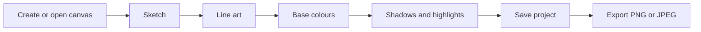
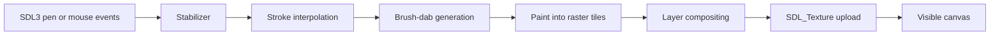

# Sable — Product Requirements

**Status:** draft for implementation · **Owner:** project lead
**Stack:** C++23 · SDL3 · Dear ImGui

---

## 1. Problem

Linux has capable painting software, but the strong options are heavy. Krita is
excellent and large; GIMP is not built for painting. An artist who wants to open
a program, sketch for twenty minutes, and close it is choosing between tools that
take a while to start, present a great deal of interface, and expect reasonable
hardware.

PaintTool SAI is the reference for the opposite feel — it starts quickly, does a
focused set of things, and its brush response is immediate. It is Windows-only,
proprietary, and paid.

**Sable** is a lightweight open-source raster painting application, aimed at
that gap: fast pen response and a small interface, on ordinary hardware. Linux
is where it started and where it is developed; Windows and macOS are supported
targets rather than someday-maybe (§3, D-019).

## 2. Who it is for

| User | Need | What they judge it on |
|---|---|---|
| Hobbyist illustrator on Linux | Sketch and colour without a heavyweight tool | Does the pen feel right, and does it start fast |
| Artist migrating from SAI | A familiar workflow that runs natively | Pressure response, stabilizer, layer basics |
| Student on modest hardware | Something usable on an old laptop | No stutter, no GPU requirement |

Not for: photo retouching, print production, animation, or professional colour
management workflows. Those users are already well served, and pulling toward
them would cost the thing that makes this worth building.

## 3. Goals and non-goals

**Goals**

1. Pen input feels immediate — the mark appears where and when the hand expects.
2. An artist can start drawing within seconds of launching, with no setup.
3. It runs well **at its default settings** on ordinary hardware with no
   discrete GPU. Anything that needs more is a runtime switch (§4, D-019).
4. It works offline, with no account and no telemetry.
5. Pressure curves, brush settings, panels, and shortcuts are the artist's to
   adjust.
6. Core drawing work is complete before any advanced simulation is attempted.
7. It runs on Linux, Windows, and macOS.
8. It opens the artist's existing work: PSD, ORA, and KRA import and export.

**No longer non-goals** — D-019 released these, and records what it cost:

- Windows and macOS support (goal 7). The build already produces both.
- GPU-accelerated painting — now an opt-in compositing backend, off by default,
  with the CPU path as the reference implementation (D-021).
- Reading and writing `.psd`, `.ora`, and `.kra` (goal 8).
- 8-bit-only colour — 16-bit is optional per document, 8-bit stays the default
  (D-023).

**Non-goals**

- `.sai2` in either direction, and any SAI source, asset, icon, brush texture,
  or interface artwork. This is a legal boundary, not a scope one, and no
  licence change reaches it — see §7, D-010 and D-020.
- `.psd` or `.kra` as the *working* format. They are import and export targets;
  `.sable` is what Sable saves (D-011).
- Physically simulated water, bristles, or particles.
- Plugins, scripting, cloud, or collaboration.

## 4. Product principles

These decide arguments later, so they are ranked.

1. **Never lose the artist's work.** Beats every other consideration including
   performance and simplicity.
2. **Pen response over feature count.** A tool that feels good with six brushes
   beats one that feels laggy with sixty.
3. **Useful before complex.** Ship the whole ordinary workflow before any unusual
   capability.
4. **Modest hardware is the target at the default settings.** Sable must stay
   usable on an old laptop with nothing switched on — CPU compositing, 8-bit
   colour. Capabilities that need more hardware are runtime switches, never
   build-time ones, so there is one binary and the artist chooses. Test on the
   old laptop with the defaults, not only on the developer's machine (D-019).
5. **The artist controls the response.** Hardware and drivers supply raw data;
   the artist decides what it means.

## 5. Constraints

| Constraint | Value | Source |
|---|---|---|
| Language | C++23, floor GCC 14 / Clang 18 | D-001 |
| Window, input, rendering | SDL3 | D-002 |
| UI | Dear ImGui over `imgui_impl_sdl3` + `imgui_impl_sdlrenderer3` | D-002 |
| Build | CMake + Ninja; `engine` and `app` targets | D-003 |
| Rendering | CPU compositing by default and as the reference; opt-in GPU backend | D-007 → D-021 |
| Colour depth | 8-bit default, 16-bit optional per document | D-004 → D-023 |
| Main loop | Event-driven, not a spin loop | D-008 |
| Licence | Any open source licence; `LICENSE` changes with the code, in the same commit | D-009 → D-020 |
| Originality | No SAI code, assets, icons, or file internals | D-010 |

**Why SDL3 and not Qt or GTK:** the choice was made on one criterion — which
option delivers pen pressure. SDL3's `SDL_PenAxis` exposes seven axes (pressure,
X/Y tilt, distance, barrel rotation, slider, tangential pressure) with a stable
`SDL_PenID` per device, which is more of the stylus than any alternative
evaluated. And because we pump the event queue ourselves, there is no toolkit
rate-limiting to work around. Full comparison in `DECISION-LOG.md` D-002.

**Display server:** SDL3 supports X11 and Wayland. Unlike a GTK4-based build,
this project is not automatically Wayland-only — but pen support may differ
between SDL video backends, so the US-00 spike tests both before we promise
either.

## 6. Known limitation: accessibility

Dear ImGui provides no AT-SPI integration. A screen-reader user cannot operate
this application. Qt or GTK would have given that for free; SDL3 + ImGui does not,
and that was accepted knowingly as the cost of the input layer (D-002).

What we commit to instead, as a hard requirement rather than an aspiration:

- Every action reachable by keyboard, with no mouse-only feature.
- Every binding reassignable, so users with limited mobility can adapt the map.
- Interface scaling that works, for low-vision users.

This is a real gap, recorded here so it is a decision rather than an oversight.
Revisit if a user asks — the honest answer today is that the application is not
screen-reader accessible.

## 7. Originality boundary

Sable may study PaintTool SAI's publicly visible workflow and feature
categories. It must not reuse SAI's source, icons, brush textures, bundled
assets, interface artwork, or project-format internals.

This boundary is unaffected by D-020, which allows Sable to adopt any open
source licence: SAI's code and assets are proprietary and no licence we adopt
makes them available, and SAI's EULA almost certainly forbids the reverse
engineering that `.sai2` support would need.

The SAI observation notes this project started from were competitor research for
feature planning, not a specification — and one of them recorded a single
artist's personal key bindings rather than any default (see D-101). Original
names, icons, presets, and file format throughout.

## 8. Workflow the product must support



## 9. Workspace layout

| Area | Purpose |
|---|---|
| Top menu and quick bar | File actions, view controls, stabilizer, selection |
| Left tool panel | Tools, brush presets, brush settings, size presets |
| Centre canvas | Pan, zoom, rotate, draw, select, transform |
| Right colour panel | Colour wheel, HSV/HSL, swatches, mixer |
| Right layer panel | Layer stack, opacity, blend modes, visibility, masks, folders |

Panels become dockable at Milestone 4, not before. Earlier milestones use a fixed
layout — building a docking system before there is anything worth docking is the
wrong order, and ImGui's docking support needs a branch decision first (D-104).

The colour wheel, layer list, and brush-preset grid are custom ImGui widgets we
write. Budget for that; they would have been free in Qt.

## 10. Functional scope by stage

### Stage A — Minimum viable drawing (Milestones 1–2)

New canvas, save, PNG export. One raster layer. Pencil, eraser, colour picker,
pan, zoom, rotate. Undo and redo. Mouse plus tablet pressure. One clean,
responsive round brush.

### Stage B — Illustration workflow (Milestone 3)

Multiple raster layers with opacity, visibility, reorder, duplicate, delete,
merge, groups. Selection, bucket fill, transform, clipping groups. Blend modes:
normal, multiply, screen, add, overlay. Airbrush, marker, opaque brush, basic
textured brush. Project recovery.

### Stage C — Artist experience (Milestone 4)

Custom brush presets. Stabilizer levels. Assignable shortcuts with Ctrl, Shift,
and Alt. Dockable panels, interface scaling, light and dark themes, tablet
calibration UI. Watercolour, blending, dilution, persistence, smudge.

### Stage D — Later

Layer masks and advanced selection. Perspective rulers, grids, symmetry, vector
linework. Optional GPU display acceleration. Colour management and higher bit
depth. More export and import formats. Text — which will need SDL3's text-input
APIs rather than ImGui's default fields, because IME support is weak (D-002).

## 11. Engine requirements



- Tiled raster canvas, 256 × 256 pixels, sparsely allocated.
- Only changed tiles are recomposited and re-uploaded; only the visible region is
  drawn.
- One streaming `SDL_Texture` per visible tile. Pan and zoom are the destination
  rectangles; the GPU scales for free. Evict textures for off-screen tiles.
- Input segments become evenly spaced dabs, with spacing carried across segment
  boundaries so fast strokes have no gaps.
- Premultiplied alpha internally, straight alpha at every boundary, and
  `SDL_BLENDMODE_BLEND_PREMULTIPLIED` when drawing canvas textures.
- Undo stores changed tile regions, never full-canvas copies.
- CPU compositing by default, and the CPU path stays the reference the GPU
  backend is checked against (D-021).
- The full SDL event queue is drained every iteration — every queued motion event
  becomes a sample. Keeping only the newest visibly degrades stroke quality.

Structures are specified in `DATA-MODEL.md`, including how to assemble an
`InputSample` from SDL's separate motion and axis events. Brush implementation
order: pencil, eraser, opaque brush, airbrush, marker, watercolour, smudge, then
specialised.

## 12. Performance requirements

| Concern | Requirement |
|---|---|
| Startup | Drawable canvas in under 1 second on a mid-range laptop |
| Stroke latency | No perceptible lag between pen and mark at normal drawing speed |
| Idle cost | Near-zero CPU when the artist is not drawing (D-008) |
| Large documents | 4000 × 4000 stays responsive while painting in one corner |
| Memory | Tile allocation proportional to painted area, not canvas area |
| Undo | Bounded memory with a stated cap and a visible policy (D-102) |
| Saving | Never blocks input — dirty tiles are cloned and encoded on a worker |

## 13. Tablet and pressure requirements

The driver supplies raw input; Sable owns what it means.

```
stylus → raw pressure and position → deadzone and rescale → smoothing
→ artist's pressure curve → per-brush mapping → pixels
```

Required: Soft, Normal, Hard, and custom pressure curves; minimum-pressure
threshold; maximum-pressure clamp; smoothing for noisy devices; per-device
profiles keyed on `SDL_PenID`; per-brush mapping to size, density, blending, or
texture; and a visual test pad.

The normalisation order above is fixed and unit-tested — applying the curve
before the deadzone produces a device-dependent feel that is nearly impossible to
diagnose from a user report.

Mouse input must remain a first-class path. Everything works without a tablet.

## 14. File formats

| Need | Direction |
|---|---|
| Working file | `.sable` — ZIP with a JSON manifest and PNG tiles (D-011) |
| First export | PNG |
| Later exports | JPEG, WebP |
| Interchange | PSD, ORA, and KRA import and export (§3 goal 8) |
| Reliability | Recovery data never overwrites the artist's file (D-013) |

## 15. Milestones

**M1 — Proof of drawing.** 1024 × 1024 white canvas, smooth black strokes from
the mouse, undo, redo, clear, PNG export.

**M2 — Tablet feel.** Pressure drives size and density. Stabilizer works. A test
panel confirms input quality. *Gated on the D-002 stylus spike passing.*

**M3 — Practical illustration.** Multiple layers, basic brushes, colour picker,
fill, selection, project save and load.

**M4 — Sable identity.** Custom shortcuts, brush presets, dockable panels,
recovery, watercolour and smudge, documented open-source release.

## 16. Acceptance for v1

- An artist can finish a simple illustration without another program.
- Fast strokes have no visible gaps.
- A tablet works, with adjustable pressure response.
- Large documents stay responsive on a modest Linux computer.
- Projects save and recover reliably, and nothing silently overwrites user files.
- The default interface stays simple.
- Every action is reachable from the keyboard (§6).
- No SAI code, assets, or protected format internals are present.

Per-story acceptance criteria for M1 and M2 are in `USER-STORIES.md`.

## 17. Risks

| Risk | Impact | Response |
|---|---|---|
| SDL3 pen support incomplete on a Linux backend | Fatal — the product has no reason to exist | US-00 spike on X11 *and* Wayland before M2; D-002a fallback reads `zwp_tablet_v2`/XInput2 directly |
| SDL emits synthetic mouse events for pens | Every stroke processed twice, subtly doubled paint | Disable the hint at startup; assert it in the spike |
| ImGui widget work is larger than estimated | M3/M4 slip | Custom widgets are colour wheel, layer list, preset grid — prototype the colour wheel early to calibrate |
| ImGui docking is on a branch | Late disruption at M4 | Decide D-104 at M2, not M4 |
| Accessibility gap draws criticism | Reputational, and real for affected users | Documented in §6 up front; keyboard operability delivered as compensation |
| Data race in the background save | Corrupted project files | Snapshot-and-hand-off discipline in `DATA-MODEL.md`; run the save path under ThreadSanitizer in CI |
| CPU compositing too slow on large canvases | Missed performance goal | Dirty-tile discipline first; threading only if profiling demands it |
| Scope creep toward Krita | Never ships | D-019 removed the non-goals that used to end this argument. Milestone ordering and principle 3 are what is left — a weaker fence, recorded as such |
| Copyleft dependency shipped under the wrong `LICENSE` | Infringement; injunction against distribution | D-020: `LICENSE` changes in the same commit as the code, and the licence is checked before the dependency is added |
| Solo-maintainer burnout | Project dies | Milestones are independently useful; M1 alone is a working toy |

## 18. Open questions

Tracked in `DECISION-LOG.md` as D-100 to D-106: on-disk tile compression, default
keyboard map, undo memory policy, stabilizer algorithm, ImGui docking branch,
colour management, and packaging. None blocks Milestone 1.

## 19. First action

Run the US-00 spike if a tablet is available — half a day, and it gates the whole
toolkit decision. Then create the CMake project (D-003) and build Milestone 1
only: an SDL3 window with a 1024 × 1024 canvas, mouse input converted to evenly
spaced dabs blended into tiled RGBA buffers, undo, and PNG export.
